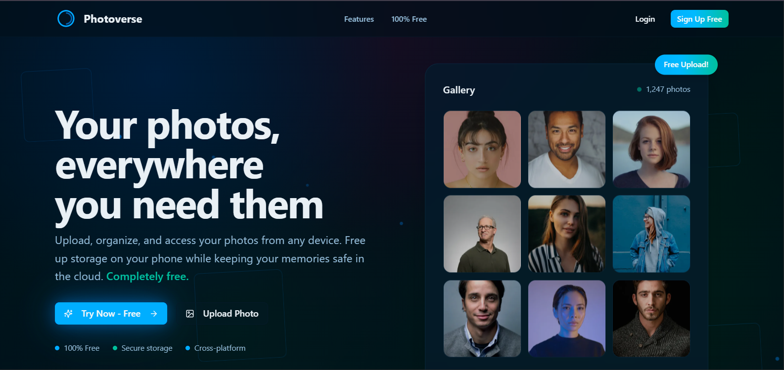
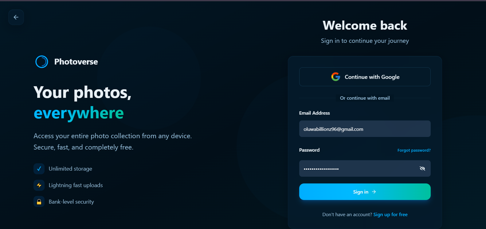
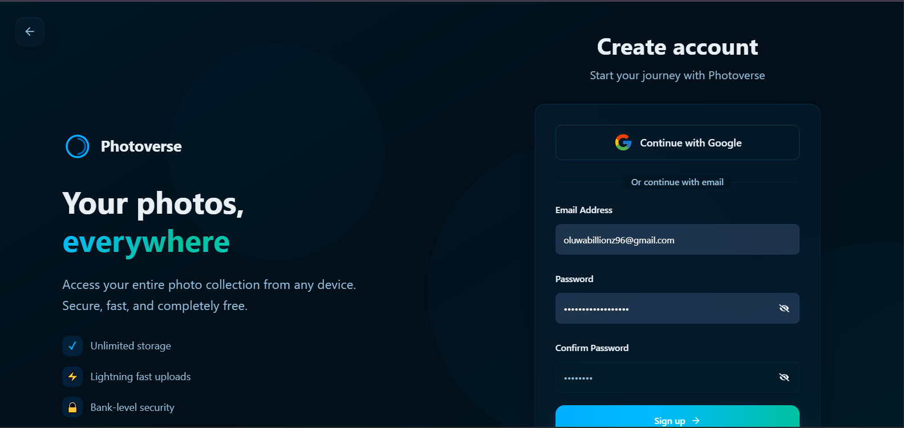
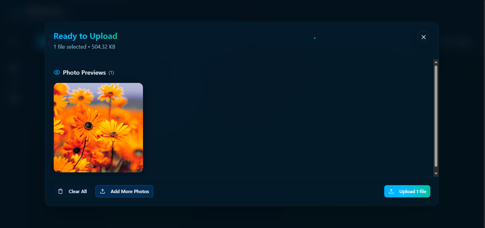

# 📸 Photoverse

<div align="center">


**Your photos, everywhere you need them**

A modern, cloud-based photo management platform built with Next.js 15, featuring a beautiful dark theme and seamless user experience.

[](https://photoverse-eight.vercel.app)
[](https://nextjs.org/)
[](https://www.typescriptlang.org/)
[](https://tailwindcss.com/)
[](https://redux-toolkit.js.org/)

[Live Demo](https://photoverse-eight.vercel.app) • [Documentation](./docs/README.md) • [Report Bug](https://github.com/yourusername/photoverse/issues) • [Request Feature](https://github.com/yourusername/photoverse/issues)

</div>

---

## 📋 Table of Contents

- [Overview](#-overview)
- [Features](#-features)
- [Tech Stack](#-tech-stack)
- [Getting Started](#-getting-started)
- [Project Structure](#-project-structure)
- [Key Features Deep Dive](#-key-features-deep-dive)
- [API Integration](#-api-integration)
- [State Management](#-state-management)
- [Authentication Flow](#-authentication-flow)
- [Deployment](#-deployment)
- [Contributing](#-contributing)
- [License](#-license)

---

## 🌟 Overview

**Photoverse** is a full-featured cloud photo management application that allows users to upload, organize, and access their photos from anywhere. Built with modern web technologies, it offers a beautiful dark-themed interface with smooth animations and an intuitive user experience.

### 📸 Screenshots

<div align="center">

#### Landing Page


#### Photo Gallery


#### Folder Management


#### Authentication
<table>
  <tr>
    <td></td>
    <td></td>
  </tr>
  <tr>
    <td align="center">Login Page</td>
    <td align="center">Register Page</td>
  </tr>
</table>

#### Photo Upload


</div>

### Why Photoverse?

- **100% Free** - No hidden costs or premium tiers
- **Unlimited Storage** - Upload as many photos as you need
- **Cross-Platform** - Access from any device with a browser
- **Secure** - JWT-based authentication with CSRF protection
- **Fast** - Optimized image loading with Cloudinary CDN
- **Beautiful UI** - Modern glassmorphism design with smooth animations

---

## ✨ Features

### Core Features

- 🖼️ **Photo Management**
  - Upload multiple photos simultaneously
  - Organize photos into custom folders
  - Mark photos as favorites
  - Move photos to trash (soft delete)
  - View photos in full-screen modal
  - Automatic image optimization via Cloudinary

- 📁 **Folder Organization**
  - Create unlimited folders
  - Rename folders (except default "General" folder)
  - View folder thumbnails
  - Browse photos by folder
  - Automatic folder creation with first upload

- 🔐 **Authentication & Security**
  - Email/password registration
  - Email verification with OTP
  - Secure login with JWT tokens
  - CSRF protection
  - Password reset flow
  - Session management with automatic token refresh

- 🎨 **User Interface**
  - Beautiful dark theme with glassmorphism effects
  - Responsive design (mobile, tablet, desktop)
  - Smooth animations with Framer Motion
  - Loading states and skeletons
  - Toast notifications
  - Context menus and dropdowns
  - Pagination for large collections

- 📱 **Mobile Experience**
  - Touch-friendly interface
  - Swipeable galleries
  - Mobile navigation menu
  - Optimized image loading
  - Responsive layouts

---

## 🛠️ Tech Stack

### Frontend

- **Framework**: [Next.js 15](https://nextjs.org/) (App Router)
- **Language**: [TypeScript 5](https://www.typescriptlang.org/)
- **Styling**: [Tailwind CSS 4](https://tailwindcss.com/)
- **State Management**: [Redux Toolkit 2.8](https://redux-toolkit.js.org/) with RTK Query
- **Animations**: [Framer Motion 12](https://www.framer.com/motion/)
- **Form Handling**: [React Hook Form 7](https://react-hook-form.com/)
- **Validation**: [Zod 4](https://zod.dev/)
- **Icons**: [Lucide React](https://lucide.dev/) & [React Icons](https://react-icons.github.io/react-icons/)
- **HTTP Client**: [Axios 1.13](https://axios-http.com/)
- **Notifications**: [React Hot Toast](https://react-hot-toast.com/)

### UI Components

- **Base Components**: Custom components built with Radix UI primitives
  - Dialog/Modal
  - Dropdown Menu
  - Context Menu
  - Form Fields
  - Buttons
  - Cards

### Backend Integration

- **API**: RESTful API with JWT authentication
- **Image Storage**: [Cloudinary](https://cloudinary.com/)
- **Authentication**: JWT tokens with HTTP-only cookies
- **CSRF Protection**: X-XSRF-TOKEN headers

### Development Tools

- **Package Manager**: npm
- **Linting**: ESLint with Next.js config
- **Type Checking**: TypeScript strict mode
- **Code Formatting**: Prettier (recommended)

---

## 🚀 Getting Started

### Prerequisites

- **Node.js** 20.x or higher
- **npm** 10.x or higher
- **Backend API** running (see [API Documentation](./docs/API.md))

### Installation

1. **Clone the repository**

```bash
git clone https://github.com/yourusername/photoverse.git
cd photoverse
```

2. **Install dependencies**

```bash
npm install
```

3. **Set up environment variables**

Create a `.env` file in the root directory:

```env
# Application URLs
NEXT_PUBLIC_URL=https://photoverse-eight.vercel.app
NEXT_PUBLIC_BASE_URL=http://localhost:8000/api/v1/

# Cloudinary Configuration
NEXT_PUBLIC_CLOUDNAME=your_cloudinary_cloud_name

# Environment
NODE_ENV=development
```

4. **Run the development server**

```bash
npm run dev
```

5. **Open your browser**

Navigate to [http://localhost:3000](http://localhost:3000)

### Build for Production

```bash
npm run build
npm start
```

### Linting

```bash
npm run lint
```

---

## 📁 Project Structure

```
photoverse/
├── app/                          # Next.js App Router
│   ├── (public)/                 # Public routes (no auth required)
│   │   ├── favourites/          # Favorite photos page
│   │   ├── trash/               # Trash page (coming soon)
│   │   └── layout.tsx           # Public layout wrapper
│   ├── api/                     # API routes
│   │   └── oauth/               # OAuth callback handler
│   ├── auth/                    # Authentication pages
│   │   ├── login/              # Login page
│   │   ├── register/           # Registration page
│   │   ├── verify-email/       # Email verification
│   │   └── forgot-password/    # Password reset flow
│   ├── folders/                # Folder management
│   │   ├── [folderName]/       # Dynamic folder view
│   │   │   └── [photoId]/      # Photo detail in folder
│   │   ├── layout.tsx          # Folders layout
│   │   └── page.tsx            # Folders list
│   ├── photos/                 # Photo management
│   │   ├── [photoId]/          # Photo detail view
│   │   ├── layout.tsx          # Photos layout
│   │   └── page.tsx            # Photos grid
│   ├── globals.css             # Global styles & theme
│   ├── layout.tsx              # Root layout
│   ├── page.tsx                # Landing page
│   └── loading.tsx             # Global loading state
│
├── components/                  # React components
│   ├── EmptyStates/            # Empty state components
│   │   ├── EmptyFavourite.tsx
│   │   ├── EmptyFolder.tsx
│   │   └── EmptyPhotos.tsx
│   ├── forgot-password/        # Password reset components
│   │   ├── choice-step.tsx
│   │   ├── email-step.tsx
│   │   ├── reset-password.tsx
│   │   ├── verify-email-for-password-recovery.tsx
│   │   └── password-reset-success.tsx
│   ├── Input/                  # Form input components
│   │   ├── Input.tsx
│   │   └── password-input.tsx
│   ├── loaders/                # Loading components
│   │   ├── FolderLoader.tsx
│   │   ├── Loading.tsx
│   │   ├── PhotoLoader.tsx
│   │   └── Spinner.tsx
│   ├── modals/                 # Modal dialogs
│   │   ├── AddPhotoModal.tsx
│   │   ├── ContextModal.tsx
│   │   ├── CreateFolderModal.tsx
│   │   ├── ImagePreviewModal.tsx
│   │   └── RenameFolderModal.tsx
│   ├── ui/                     # Base UI components (Radix UI)
│   │   ├── button.tsx
│   │   ├── card.tsx
│   │   ├── context-menu.tsx
│   │   ├── dialog.tsx
│   │   ├── dropdown-menu.tsx
│   │   ├── field.tsx
│   │   ├── form.tsx
│   │   ├── input.tsx
│   │   ├── label.tsx
│   │   └── separator.tsx
│   ├── animated-background.tsx  # Animated background component
│   ├── auth-layout.tsx         # Authentication layout wrapper
│   ├── AuthenticationMenu.tsx  # Mobile auth menu
│   ├── back-button.tsx         # Back navigation button
│   ├── ComingSoon.tsx          # Coming soon placeholder
│   ├── CreateFolder.tsx        # Folder creation component
│   ├── CTASection.tsx          # Call-to-action section
│   ├── dropDown.tsx            # Dropdown component
│   ├── email-step.tsx          # Email input step
│   ├── FeaturesSection.tsx     # Features showcase
│   ├── FolderCard.tsx          # Folder card component
│   ├── FolderNameInput.tsx     # Folder name input
│   ├── Footer.tsx              # Footer component
│   ├── google-button.tsx       # Google OAuth button
│   ├── Header.tsx              # Header/navbar
│   ├── Hero.tsx                # Hero section
│   ├── ImageGrid.tsx           # Photo grid display
│   ├── ImageModal.tsx          # Image preview modal
│   ├── LandingPage.tsx         # Landing page composition
│   ├── Logo.tsx                # Logo component
│   ├── MainLayout.tsx          # Main app layout
│   ├── MobileNavs.tsx          # Mobile navigation
│   ├── NotFond.tsx             # 404 component
│   ├── Pagination.tsx          # Pagination controls
│   ├── PhotoDisplay.tsx        # Photo display component
│   ├── photosPreview.tsx       # Photo preview before upload
│   ├── placeholder.tsx         # Image placeholder
│   ├── progress-tracker.tsx    # Progress indicator
│   ├── shimmer-sweep.tsx       # Shimmer loading effect
│   ├── SideNav.tsx             # Side navigation
│   ├── TabLayouts.tsx          # Tab layout component
│   ├── ToastManager.tsx        # Toast notification manager
│   └── VerifyEmail.tsx         # Email verification component
│
├── hooks/                       # Custom React hooks
│   ├── useApiMutation.ts       # API mutation handler
│   ├── useAppDispatch.ts       # Typed Redux dispatch
│   ├── useCurrentPage.tsx      # Pagination state
│   ├── useInputContext.ts      # File input context
│   ├── useLogout.ts            # Logout functionality
│   ├── useModalContext.ts      # Modal state management
│   └── useScreenSize.ts        # Responsive breakpoints
│
├── lib/                         # Utilities and configuration
│   ├── slices/                 # Redux slices
│   │   ├── authSlice.ts        # Authentication state
│   │   └── photoSlice.ts       # Photo selection state
│   ├── utils/                  # Utility functions
│   │   ├── handleInputChange.ts # File input handlers
│   │   ├── handlePhotoUpload.ts # Photo upload logic
│   │   └── Validation.ts       # Form validation
│   ├── apiTypes.ts             # API type definitions
│   ├── axios.ts                # Axios instance config
│   ├── store.ts                # Redux store configuration
│   ├── types.ts                # TypeScript types
│   ├── utils.ts                # General utilities
│   └── zod-schemas.tsx         # Zod validation schemas
│
├── services/                    # API services
│   ├── api.ts                  # RTK Query API definitions
│   └── auth.ts                 # Authentication API calls
│
├── state/                       # State management
│   └── Providers/
│       └── AppProvider.tsx     # Redux Provider wrapper
│
├── public/                      # Static assets
│   ├── folder_thumbnail.png
│   ├── logo-with-text.png
│   ├── logo.png
│   ├── photoverse-logo.png
│   └── photoverse.ico
│
├── docs/                        # Documentation (see below)
│   ├── README.md
│   ├── API.md
│   ├── ARCHITECTURE.md
│   ├── AUTHENTICATION.md
│   ├── COMPONENTS.md
│   ├── DEPLOYMENT.md
│   └── CONTRIBUTING.md
│
├── .env                         # Environment variables
├── .gitignore                  # Git ignore rules
├── baseUrl.ts                  # API base URL config
├── components.json             # shadcn/ui config
├── eslint.config.mjs           # ESLint configuration
├── next.config.ts              # Next.js configuration
├── next-env.d.ts               # Next.js TypeScript declarations
├── package.json                # Dependencies and scripts
├── postcss.config.mjs          # PostCSS configuration
├── proxy.ts                    # API proxy configuration
├── README.md                   # This file
└── tsconfig.json               # TypeScript configuration
```

---

## 🎯 Key Features Deep Dive

### Photo Upload & Management

Photoverse provides a seamless photo upload experience:

1. **Multi-file Upload**: Select and upload multiple photos at once
2. **Preview Before Upload**: Review selected photos before uploading
3. **Cloudinary Integration**: Automatic image optimization and CDN delivery
4. **Progress Tracking**: Visual feedback during upload
5. **Folder Assignment**: Upload directly to specific folders

**Implementation Details:**
- Uses `handleFileChange` utility for file validation
- Cloudinary loader for optimized image delivery
- Redux state management for upload progress
- Lazy loading with Next.js Image component

### Folder Organization

Organize your photos with a flexible folder system:

1. **Default "General" Folder**: All photos without a folder go here
2. **Custom Folders**: Create unlimited folders with custom names
3. **Folder Thumbnails**: Automatic thumbnail from latest photo
4. **Rename Folders**: Update folder names anytime
5. **Folder Navigation**: Browse photos by folder

**Implementation Details:**
- RTK Query for folder CRUD operations
- Optimistic updates for instant UI feedback
- Folder validation with Zod schemas
- Context menus for folder actions

### Authentication System

Secure authentication with multiple flows:

1. **Registration**:
   - Email/password with strong validation
   - Email verification via OTP
   - Automatic login after verification

2. **Login**:
   - Email/password authentication
   - JWT token storage in HTTP-only cookies
   - Automatic redirect to folders page

3. **Password Reset**:
   - Email-based OTP verification
   - Secure password reset flow
   - Multiple recovery options

4. **Session Management**:
   - Automatic token refresh
   - CSRF protection
   - Secure logout

**Implementation Details:**
- JWT tokens with HTTP-only cookies
- CSRF tokens in request headers
- Automatic token refresh on 401 errors
- Redux state for auth status

### Image Grid & Display

Beautiful photo grid with advanced features:

1. **Responsive Grid**: Adapts to screen size
2. **Lazy Loading**: Load images as you scroll
3. **Placeholder States**: Shimmer effect while loading
4. **Favorite Indicators**: Heart icon on favorites
5. **Selection Mode**: Multi-select for batch operations
6. **Grouped by Date**: Photos organized by upload month

**Implementation Details:**
- CSS Grid for responsive layout
- Next.js Image component for optimization
- Cloudinary loader for custom image sizes
- Redux for selection state

---

## 🔌 API Integration

### Base Configuration

The app uses Axios with automatic token refresh:

```typescript
// lib/axios.ts
const axiosInstance = axios.create({
  baseURL: '/api/v1',
  withCredentials: true,
  headers: {
    'Content-Type': 'application/json',
  },
});

// Automatic CSRF token injection
axiosInstance.interceptors.request.use((config) => {
  const csrfToken = getCsrfToken();
  if (csrfToken) {
    config.headers['X-XSRF-TOKEN'] = csrfToken;
  }
  return config;
});
```

### RTK Query Setup

API endpoints are defined using RTK Query:

```typescript
// services/api.ts
export const PhotoverseAPI = createApi({
  reducerPath: 'photoverse API',
  baseQuery: baseQueryWithReauth,
  tagTypes: ['folders', 'photos', 'favourite'],
  endpoints: (builder) => ({
    getPhotos: builder.query<GetPhotoResponse, { page: number }>({
      query: ({ page }) => `photos?limit=60&page=${page}`,
      providesTags: ['photos'],
    }),
    // ... more endpoints
  }),
});
```

### API Endpoints

See [API Documentation](./docs/API.md) for complete endpoint reference.

---

## 🗄️ State Management

### Redux Store Structure

```typescript
{
  auth: {
    email: string;
    loading: boolean;
    verificationId: string;
    user: {
      email: string;
      isAuthenticated: boolean;
    };
  },
  photo: {
    photoIds: string[];
    selectedPhotosIds: string[];
  },
  photoverse API: {
    // RTK Query cache
  }
}
```

### Key Slices

1. **authSlice**: User authentication state
2. **photoSlice**: Photo selection and management
3. **PhotoverseAPI**: API cache and queries

See [Architecture Documentation](./docs/ARCHITECTURE.md) for more details.

---

## 🔐 Authentication Flow

### Registration Flow

```
1. User enters email/password
2. Client validates with Zod schema
3. POST /auth/register
4. Server sends OTP to email
5. User enters OTP
6. POST /auth/verify-otp
7. Server creates account & returns JWT
8. Client stores token & redirects to /folders
```

### Login Flow

```
1. User enters credentials
2. POST /auth/login
3. Server validates & returns JWT
4. If unverified, redirect to /auth/verify-email
5. If verified, redirect to /folders
```

### Token Refresh Flow

```
1. API request returns 401
2. Client automatically calls POST /auth/refresh
3. Server validates refresh token
4. Server returns new JWT
5. Client retries original request
6. If refresh fails, redirect to /auth/login
```

See [Authentication Documentation](./docs/AUTHENTICATION.md) for complete details.

---

## 🎨 Styling & Theming

### Design System

Photoverse uses a custom dark theme with:

- **Color Palette**: OKLCH color space for perceptual uniformity
- **Glassmorphism**: Frosted glass effects with backdrop blur
- **Animations**: Smooth transitions with Framer Motion
- **Typography**: Geist Sans and Geist Mono fonts
- **Spacing**: Consistent spacing scale
- **Shadows**: Layered shadows for depth

### Theme Colors

```css
--primary: oklch(0.72 0.28 240);     /* Electric blue */
--accent: oklch(0.68 0.22 180);      /* Cyan */
--background: oklch(0.16 0.03 240);  /* Dark blue-black */
--foreground: oklch(0.95 0.01 240);  /* Crisp white */
```

### Custom Animations

- `animate-float`: Floating effect for elements
- `animate-pulse-glow`: Pulsing glow effect
- `animate-shimmer`: Shimmer loading effect
- `glass`: Glassmorphism utility class

---

## 📦 Deployment

### Vercel Deployment (Recommended)

1. **Push to GitHub**

```bash
git push origin main
```

2. **Import to Vercel**
   - Go to [vercel.com](https://vercel.com)
   - Import your repository
   - Configure environment variables
   - Deploy

3. **Environment Variables**

Add these in Vercel dashboard:

```
NEXT_PUBLIC_URL=https://your-domain.vercel.app
NEXT_PUBLIC_BASE_URL=https://your-api-domain.com/api/v1/
NEXT_PUBLIC_CLOUDNAME=your_cloudinary_cloud_name
NODE_ENV=production
```

### Manual Deployment

```bash
npm run build
npm start
```

See [Deployment Documentation](./docs/DEPLOYMENT.md) for other platforms.

---

## 🤝 Contributing

We welcome contributions! Please see [CONTRIBUTING.md](./docs/CONTRIBUTING.md) for guidelines.

### Development Workflow

1. Fork the repository
2. Create a feature branch (`git checkout -b feature/amazing-feature`)
3. Commit your changes (`git commit -m 'Add amazing feature'`)
4. Push to the branch (`git push origin feature/amazing-feature`)
5. Open a Pull Request

---

## 📄 License

This project is licensed under the MIT License - see the [LICENSE](LICENSE) file for details.

---

## 🙏 Acknowledgments

- [Next.js](https://nextjs.org/) - The React Framework
- [Vercel](https://vercel.com/) - Hosting platform
- [Cloudinary](https://cloudinary.com/) - Image CDN
- [Radix UI](https://www.radix-ui.com/) - UI primitives
- [Tailwind CSS](https://tailwindcss.com/) - Utility-first CSS
- [Framer Motion](https://www.framer.com/motion/) - Animation library

---

## 📞 Support

- **Live Demo**: [https://photoverse-eight.vercel.app](https://photoverse-eight.vercel.app)
- **Documentation**: [./docs](./docs)
- **Issues**: [GitHub Issues](https://github.com/yourusername/photoverse/issues)
- **Email**: support@photoverse.com

---

<div align="center">

Made with ❤️ by the Photoverse Team

[⬆ Back to Top](#-photoverse)

</div>
